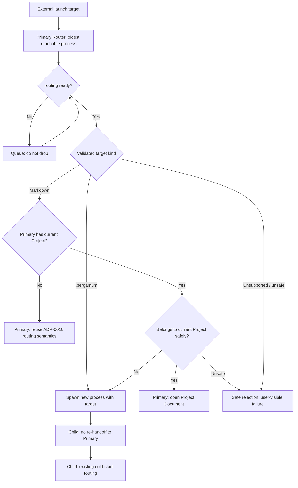
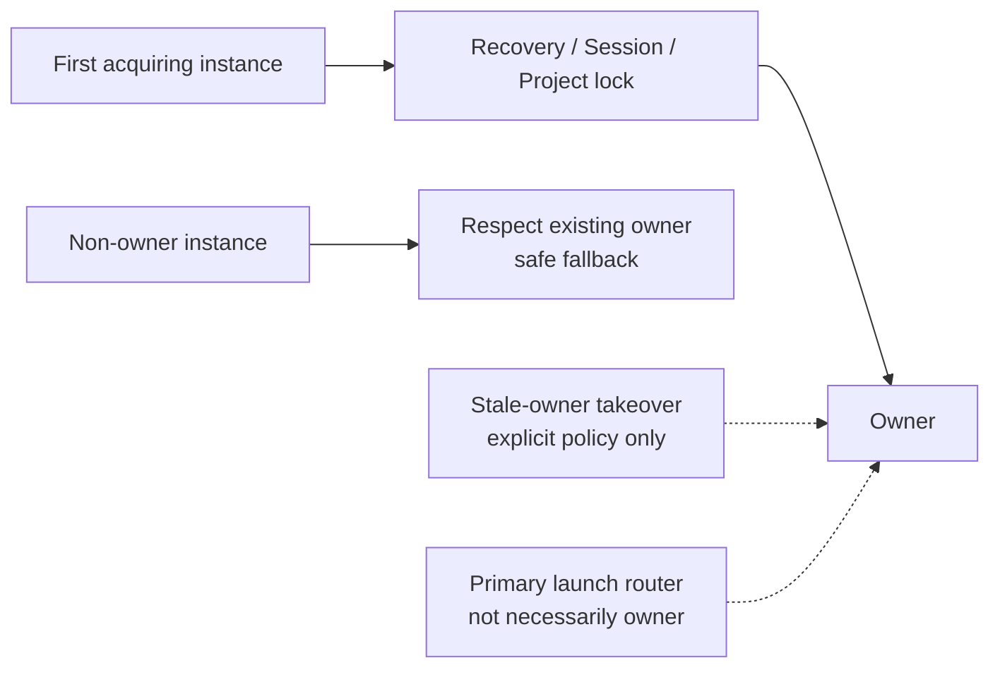

# ADR-0012: Application Instance and Launch Target Routing Policy

**Status:** Accepted

**Date:** 2026-09-02

**Updated:** 2026-10-05 (Issue #738)

> On Status: Issue #738 updates the Issue #278 proposal to the v0.90 process-per-window / Primary Router policy. Runtime routing remains unimplemented. All policies were approved at PO review on 2026-10-05, and the status is Accepted.

---

## Context

Issue #278 proposed the routing policy for launch targets received from the OS / command line / file association while Pergamum is already running. Issue #738 updates it to **process-per-window + Primary Router**, the formal policy for v0.90.

```text
1 Pergamum process = 1 BrowserWindow = 1 Session / current project context

Pergamum process A         Pergamum process B
  └ Window A                 └ Window B
      └ Session A                └ Session B
```

#272 introduced Session restore-set persistence, and #274 limited cold-start restore to at most one Session. ADR-0010 / #347 defined and implemented cold-start `.pergamum` / Markdown routing. This ADR reuses those safety conditions and defines routing in the already-running state. Multiple BrowserWindows within one process are not a v0.90 requirement.

This ADR defines policy only. Runtime handoff / routing / queue / child spawn remain unimplemented and belong to separate Issues after the ADR update and PO review.

---

## Related ADRs

- **ADR-0003 UI Interaction Architecture** - used as a premise for the renderer / main boundary and the separation of project state, current document state, and open document state. This ADR does not change ADR-0003 frozen interaction invariants.
- **ADR-0006 Durable State Categories and Settings Architecture** - used as a premise that session / recovery / runtime coordination are categories separate from settings.
- **ADR-0007 Recovery and Runtime Coordination** - used as a premise for multi-instance Recovery separation and the rule that runtime coordination markers are advisory signals, not hard locks. This ADR does not redesign Recovery ownership.
- **ADR-0008 Project File, Project Root, and Project-Local Recovery Layout** - used as a premise for the `.pergamum` project file, project root, project boundary, `metadata.project_id`, and project root as the unit of locking / multi-open detection.
- **ADR-0009 Working Copy Persistence and Recovery Model** - this ADR does not change the non-destructive working-copy Recovery contract, the separation of `sessionId` and `instanceRunId`, or the multi-instance claim policy.
- **ADR-0010 Startup File-Open Routing (Cold Start)** - used as a premise for cold-start `.pergamum` / Markdown routing, URL-like input rejection, and the safety condition that project-owned Markdown must not fall back to standalone writable. This ADR defines the runtime / already-running instance routing policy that ADR-0010 left as future work.

---

## Definitions

**Application instance**

One Pergamum application process / run, represented by `instanceRunId`. In v0.90, one process owns one BrowserWindow and one Session / current project context. Process identity and logical Session identity remain distinct.

**Primary Router**

The oldest reachable Pergamum process. It is the representative entry point for external launch target routing; this does not imply Recovery / Session persistence / Project write lock ownership. Concrete primary election, reachability / liveness, and stale-primary takeover conditions belong to follow-up Issues.

**Launch target / internal routed launch**

A launch target is a `.pergamum` or Markdown file-open request delivered through OS file association / shell double-click / command line・argv / Electron `second-instance` style handoff / future macOS `open-file`. An internal routed launch is a child process launch performed by Primary as a routing destination and is distinguished from an external launch.

**Routing ready**

The lifecycle point at which Primary has completed startup / Session Restore enough to safely process incoming targets. Follow-up Issues define the concrete condition.

**Project Document / Standalone Markdown**

This ADR uses ADR-0010 document kinds. A Project Document is project-owned Markdown; Standalone Markdown is an External File Document with no enclosing project. Window context and document kind are independent axes.

---

## Decision

### Application instance model

**AIR-1. v0.90 adopts the process-per-window model.**

The formal policy is `1 process = 1 BrowserWindow = 1 Session / current project context`. Multiple windows are provided by multiple Pergamum processes. Strict single-app-instance enforcement is not adopted. An in-process BrowserWindow registry is not a v0.90 requirement and is Future Work alongside in-process multi-window support.

**AIR-2. External launch targets converge on the Primary Router when possible.**

The Primary Router is the oldest reachable Pergamum process. Platform entry points follow the same policy. A cold start with no Primary follows existing ADR-0010 routing. This ADR does not prescribe a concrete handoff / election mechanism.

**AIR-3. Primary owns launch-routing decisions.**

Based on target kind and its own current Project, Primary decides whether to handle the target itself, route to a new process, or reject safely. Secondary processes must not perform random process selection / ad-hoc routing. Searching other processes for an already-open project and delivering there is not part of the v0.90 policy.

**AIR-4. Incoming targets before routing readiness are queued.**

Targets that cannot safely be processed during startup / Session Restore must not be dropped. Keep them queued and process them after readiness. Physical queue implementation, ordering, deduplication, and failure handling belong to follow-up Issues.

**AIR-5. Routing must not implicitly replace existing working environments.**

Do not silently discard existing Projects / Sessions / dirty working copies for routing. In particular, Markdown outside the current Project and runtime `.pergamum` targets are delivered to a new process without changing Primary's Project / Session / dirty documents. Project-owned Markdown received by a projectless Primary uses the existing project-open lifecycle under MD-2.

### Launch target routing flow

This is a conceptual policy diagram; input validation and safe rejection apply to every processing path.



### `.pergamum` launch targets

**PERGAMUM-1. Runtime `.pergamum` targets route to a new process.**

Whether or not Primary has a Project, pass the target to a new Pergamum process and open it through that process's existing cold-start project open. Do not implicitly Close Project / switch Project in an existing window. Cold start itself follows ADR-0010 and may open the target project in that process's first window.

**PERGAMUM-2. Existing windows and dirty documents remain unchanged.**

Because the source window does not switch Project, dirty confirmation there is unnecessary. This does not bypass the destination's existing project-open lifecycle / confirmation.

**PERGAMUM-3. Attempt an open in a new process even if the same project is already open.**

Do not satisfy the request merely by activating an existing same-project window. The child follows existing Project write lock / read-only confirmation policy. Open writable if the lock is available; use the explicit read-only confirmation flow if an owner already exists. Cancel / failure fails safely; routing must not steal the lock.

**PERGAMUM-4. Project identity is `metadata.project_id`.**

Under ADR-0008, the `.pergamum` path is a locator and the project name is a display name; neither is identity.

```text
Primary process A / Window A: A.pergamum
External launch: B.pergamum (or A.pergamum again)
  -> Primary spawns process B with target
  -> B bypasses re-handoff and performs cold-start project open
  -> Window A remains unchanged; B follows existing lock / read-only policy
```

### Markdown launch targets

**MD-1. Determine Primary's current Project from authoritative main-process state.**

Existing `currentProjectRootPath()` / `currentProjectId()` / `currentActiveProjectFilePath()` are reference examples, not a fixed API contract. Do not infer Project presence from renderer appearance or the active tab.

**MD-2. A projectless Primary handles incoming Markdown itself.**

Reuse the ADR-0010 / #347 classifier and cold-start routing semantics.

- No enclosing project: open as Standalone / External File Document in Primary's window.
- Exactly one `.pergamum` in the nearest enclosing root: open the project through Primary's existing project-open lifecycle, then open the target as a Project Document. Preserve Project lock / read-only confirmation.
- Ambiguous / unsafe: follow existing safe rejection policy.

This is runtime open; it does not rerun Primary's entire startup / Session Restore. Preserve the non-destructive contract for existing dirty working copies.

**MD-3. Markdown belonging to the current Project opens in Primary as a Project Document.**

Membership checks must align with existing project-boundary / `realpath` safety policy. Use the already-open current Project context; opening Markdown from that project externally must not create another process / read-only window. If the target cannot be resolved as a Project Document, surface a safe failure / status and never fall back to standalone writable.

**MD-4. Markdown outside the current Project routes to a new process.**

A target safely determined not to belong to the current Project is passed to a new Pergamum process and handled through the child's normal cold-start routing. Primary's current Project / Session / dirty documents remain unchanged. Even if the target project is open in another process, do not search for that window to activate it. If the child discovers an enclosing project, it follows existing lock / read-only policy.

**MD-5. Do not duplicate classifier / safety policy.**

Reuse ADR-0010 / #347 and the policy in existing `src/main/startupLaunchTarget.ts` / `src/main/startupMarkdownRouting.ts`. Apply the same boundary and path safety conditions to current Project membership checks.

- Preserve the `.md` / `.markdown` entry-name allowlist, local regular file validation, and URL-like input rejection (`.pergamum` also rejects URL-like input).
- Resolve symlinks with `realpath` before enclosing-project discovery. Classify extensions by entry name; do not add validation of the real target's extension (ADR-0010 PATH-4 / PATH-5).
- Enclosing-project discovery uses ADR-0010's nearest ancestor rule. Do not add blanket rejection merely because nested roots exist. Reject multiple `.pergamum` files in the nearest root or any state that cannot be safely and uniquely resolved.
- Never fall back to standalone writable for project-owned Markdown. Project opens go through existing lifecycle / write lock / read-only confirmation.
- Safety-relevant discovery / I/O / permission / unresolved symlink / document resolution failures fail safely with a user-visible explanation.

This ADR does not resolve ADR-0010's known limitations, including hardlink identity, standalone cross-process locking, and protection coverage for Recovery non-owners.

**MD-6. Duplicate handling for the same standalone Markdown is a follow-up.**

Duplicate editor prevention / cross-process locking / activation of another window is not decided here.

| Primary context | Incoming Markdown | Destination |
| --- | --- | --- |
| Projectless | No enclosing project | Primary: External File Document |
| Projectless | One safely resolved enclosing project | Primary: project-open lifecycle → Project Document |
| Current Project A | Belongs to A | Primary: Project Document |
| Current Project A | Outside A (external or another project) | New process: ADR-0010 cold-start routing |
| Any | Unsafe / unresolved classification | Safe rejection; no standalone writable fallback |

### Spawned child bypass contract

**CHILD-1. A routing destination child must not re-handoff its supplied target to Primary.**

Distinguish external launches from internal routed launches spawned by Primary. The child handles that target through its own cold-start routing. This prevents the infinite loop `Primary → spawn child → handoff to Primary → spawn child → ...`. Concrete CLI flag names, transport, and spawn implementation belong to follow-up Issues.

---

### Ownership model

This diagram shows that the primary launch router is not necessarily the same as the owner of each ownership domain.



**OWN-1. Recovery ownership is first-come-first-served.**

The instance that first acquires the relevant Recovery ownership / claim becomes the owner. Other instances must respect the existing owner and fall back safely according to the Recovery policy.

**OWN-2. Session persistence ownership is first-come-first-served.**

The instance that first acquires the relevant ownership / write authorization for Session persistence becomes the owner. Other instances must not merge, repair, or steal the Session without an explicit coordination policy.

**OWN-3. Project write lock ownership is first-come-first-served.**

The window / instance that first acquires the Project write lock becomes the writable owner. Other windows / instances follow the existing read-only project open policy.

**OWN-4. Stale-owner takeover is allowed only when an explicit stale-owner policy allows it.**

Recovery ownership, Session persistence ownership, and Project write lock ownership must not be stolen unless an explicit stale-owner policy confirms that the old owner is dead and allows takeover.

**OWN-5. The primary launch router is not necessarily the Recovery / Session / Project write lock owner.**

The primary instance is the representative entry point for launch target routing. Being primary does not automatically grant Recovery ownership, Session persistence ownership, or Project write lock ownership.

---

### Session, window, and lifecycle implications

**LIFE-1. `sessionId` is logical working environment identity; `instanceRunId` is process/run identity.**

Preserve the ADR-0009 / #274 contract. A restored Session retains its `sessionId`; a new run gets a new `instanceRunId`.

**LIFE-2. Do not implicitly merge launch targets into unrelated Sessions.**

Targets outside the current Project are delivered to a separate process's working environment. Opens in a projectless Primary also follow existing lifecycle and dirty-state safety.

**LIFE-3. Each process's single window is a routing endpoint.**

Use Primary self-handling or cold-start open in a new process. An in-process BrowserWindow registry, a registry for searching other processes' project windows, and multi-Session restore are not v0.90 requirements. Cross-process coordination for Primary reachability is a separate responsibility; follow-up Issues define its implementation.

**LIFE-4. Preserve existing Window Close and Application Quit lifecycle.**

Process-per-window routing must not implicitly close windows / Sessions in other processes. Changes to explicit Quit / platform-specific quit behavior are outside this Issue. Non-final / final window close for future in-process multi-window support is Future Work.

**LIFE-5. Close Project is detach, not Project switch or deletion.**

Launch routing does not change this meaning. Runtime `.pergamum` targets must not implicitly Close Project / switch Project in an existing window.

---

### Platform entry points

**PLAT-1. Windows / Linux file association, shell double-click, argv, and Electron `second-instance` style entry points are normalized into the same routing policy.**

Different OS entry points must not split Pergamum's application model.

**PLAT-2. macOS `open-file` is put on the same launch target routing policy in the future.**

macOS-specific event ordering, Dock activation, and file-open delivery to an already-running app are handled by follow-up implementation Issues. The application model remains the one defined by this ADR.

**PLAT-3. Routing failure is user-visible.**

Primary handoff failure, ambiguous project ownership, target not found, read-only open failure, and similar failures must not be silently ignored. Concrete error UI / retry policy is defined by follow-up Issues.

---

## Consequences

### Positive

- Fixes process-per-window as the v0.90 multi-window model and removes the need for an in-process window registry.
- Markdown belonging to Primary's current Project opens in that working environment without unnecessary extra processes / read-only windows.
- Markdown outside the current Project / runtime `.pergamum` opens in a separate process, protecting Primary's dirty working copies / Session.
- Reuses ADR-0010 / #347 classifier / safety policy and existing ownership.
- Prohibiting child re-handoff prevents routing loops.

### Negative / Trade-offs

- Cross-process handoff, Primary election / liveness, routing readiness / queue, and child spawn / bypass need implementation. Each window consumes process resources.
- Reopening the same `.pergamum` can increase the number of read-only processes / windows.
- Markdown outside the current Project goes to a new process even if its project is open elsewhere, so existing lock / read-only confirmation may apply.
- Standalone duplicate handling, hardlink identity, and known Recovery non-owner limitations remain.

---

## Alternatives Considered

### Strict single-app-instance model

Rejected.

It simplifies the application model, but a `.pergamum` launch target would tend to become a Project switch in an existing window, pulling dirty working copy / Session / Project switch confirmation problems into file association routing. It also reduces the escape hatch for working in multiple environments at once.

### Let the process that receives a launch target handle it directly

Rejected.

If external launches are handled ad hoc by each process, duplicate opens, random process selection, and inconsistency with Project write locks / Session restore-set semantics become likely.

### Treat a `.pergamum` launch target as a Project switch in an existing window

Rejected.

Project switch replaces the current project / dirty working copy / Session of an existing window. It is not the same operation as opening a `.pergamum` file from file association. A `.pergamum` launch target routes to a new project window.

### Finish a `.pergamum` launch target by activating an existing same-project window

Rejected.

This ADR treats a `.pergamum` file-open request as a request to open that project in another window. Even when the same project is already open, Pergamum attempts a new window and then follows the write lock / read-only policy.

### Guess ambiguous Markdown project ownership

Rejected.

When ADR-0010's nearest ancestor rule still cannot safely and uniquely resolve the active project file, promoting the target to a Project Document would attach it to the wrong Project / Session / lock policy. Ambiguous Markdown launch targets are rejected.

---

### Require multiple BrowserWindows within one process for v0.90

Not adopted. Preserve the existing one process / one window / one Session structure; introducing a window registry and per-window context is Future Work.

---

## Non-goals

This ADR does not implement the routing behavior.

This ADR does not introduce:

- full multi-window editor/tab detach implementation
- tab detach / redock
- editor groups
- opening the same document in multiple writable editor views
- OS clipboard integration
- external drag-and-drop import
- migration runner
- new project DB schema changes

---

## Future Work / open implementation issues

- Whether to use `requestSingleInstanceLock`, `second-instance` wiring, and concrete handoff mechanisms such as cross-process IPC / socket / pipe / lock files.
- Primary election algorithm, reachability / liveness, and stale-primary takeover.
- Child spawn and identification / bypass of internal routed launches, including CLI flag names.
- Routing-ready lifecycle and physical queue implementation / ordering / deduplication / failure handling.
- Runtime Markdown / `.pergamum` open, wiring current Project membership checks, user-visible failure / retry, and routing tests.
- File association installer and macOS `open-file` event ordering / Dock activation.
- Same-project read-only windows and standalone duplicate handling / cross-process locking.
- Future multi-BrowserWindow support within one process, in-process window registry, per-window Sessions / multi-Session restore, and non-final / final window close. These are not v0.90 requirements.

## PO review record (2026-10-05)

1. Primary Router = oldest reachable process.
2. Opening Markdown belonging to the current Project in Primary itself.
3. Sending Markdown outside the current Project to a new process.
4. Sending runtime `.pergamum` to a new process.
5. Process-per-window as the formal v0.90 multi-window model.
6. After reviewing the diff, the PO approved all policies above and promotion from `Proposed -> Accepted`.
