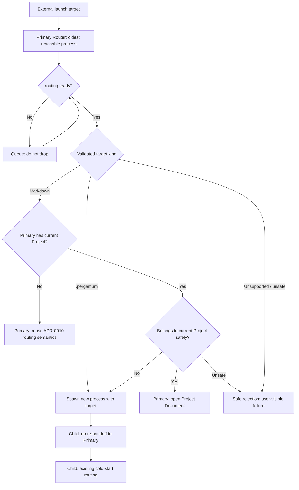
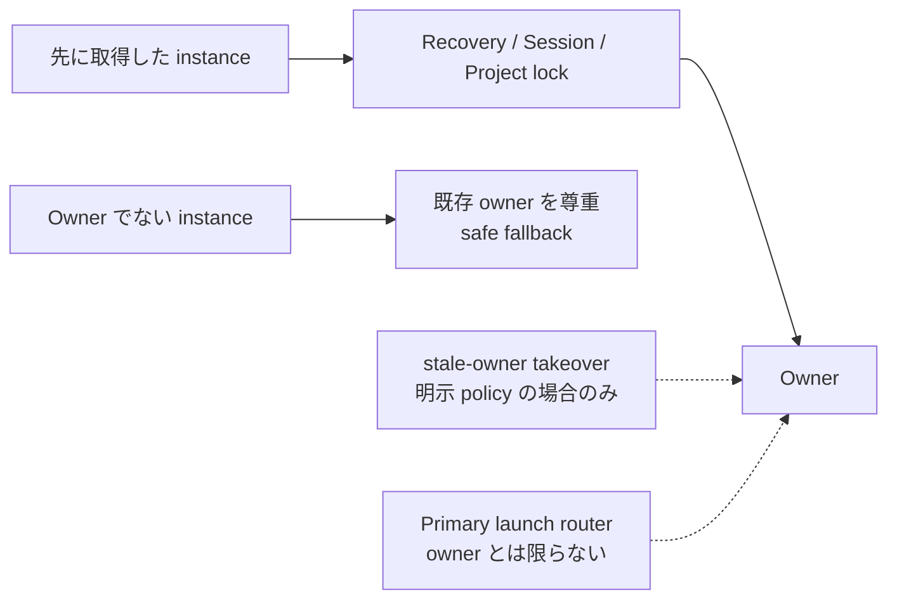

# ADR-0012: アプリケーションインスタンスと起動対象ルーティング方針

**Status:** Accepted

**Date:** 2026-09-02

**Updated:** 2026-10-05 (Issue #738)

> Status について: Issue #278 の提案を Issue #738 で v0.90 の process-per-window / Primary Router 方針に更新する。Runtime routing は未実装。2026-10-05 の PO review で全方針が承認され、Accepted とした。

---

## Context

Issue #278 は、Pergamum がすでに起動している状態で OS / command line / file association から渡される launch target の routing policy を提案した。Issue #738 はこれを v0.90 の正式方針である **process-per-window + Primary Router** に更新する。

```text
1 Pergamum process = 1 BrowserWindow = 1 Session / current project context

Pergamum process A         Pergamum process B
  └ Window A                 └ Window B
      └ Session A                └ Session B
```

#272 は Session restore-set persistence を導入し、#274 は cold start 時に restore する Session を最大 1 件とした。ADR-0010 / #347 は cold-start `.pergamum` / Markdown routing を定義・実装した。本 ADR はその安全条件を再利用し、already-running 状態の routing を定義する。1 process 内 multi-BrowserWindow は v0.90 の requirement ではない。

本 ADR は方針のみを定義する。Runtime handoff / routing / queue / child spawn は未実装であり、ADR 更新と PO review 後の別 Issue で扱う。

---

## Related ADRs

- **ADR-0003 UI Interaction Architecture** - renderer / main boundary、project state / current document / open document state separation を前提として使用する。本 ADR は ADR-0003 の frozen interaction invariants を変更しない。
- **ADR-0006 Durable State Categories and Settings Architecture** - session / recovery / runtime coordination が settings とは別カテゴリであることを前提として使用する。
- **ADR-0007 Recovery and Runtime Coordination** - multi-instance で Recovery を分離する方針、runtime coordination marker は advisory signal であり hard lock ではない方針を前提として使用する。本 ADR は Recovery ownership を再設計しない。
- **ADR-0008 Project File, Project Root, and Project-Local Recovery Layout** - `.pergamum` project file、project root、project boundary、`metadata.project_id`、project root を lock / multi-open 判定単位とする前提を使用する。
- **ADR-0009 Working Copy Persistence and Recovery Model** - working copy Recovery の非破壊 contract、`sessionId` と `instanceRunId` の分離、multi-instance claim 方針を変更しない。
- **ADR-0010 Startup File-Open Routing (Cold Start)** - cold start の `.pergamum` / Markdown routing、URL-like input rejection、project-owned Markdown を standalone writable に fallback しない安全条件を前提として使用する。本 ADR は ADR-0010 が future work とした runtime / already-running instance routing policy を定義する。

---

## Definitions

**Application instance**

1 つの Pergamum application process / run。`instanceRunId` に対応する。v0.90 では 1 process が 1 BrowserWindow と 1 Session / current project context を持つ。Process identity と logical Session identity は区別する。

**Primary Router**

到達可能な Pergamum process のうち最古の process（oldest reachable process）。外部 launch target routing の代表窓口であり、Recovery / Session persistence / Project write lock owner であることを意味しない。Primary election、reachability / liveness、stale-primary takeover の具体条件は後続 Issue で定義する。

**Launch target / internal routed launch**

Launch target は OS file association / shell double-click / command line・argv / Electron `second-instance` style handoff / 将来の macOS `open-file` などから渡される `.pergamum` または Markdown の file-open request。Internal routed launch は Primary が配送先として child process を spawn する起動であり、external launch と区別する。

**Routing ready**

Primary が startup / Session Restore を終え、incoming target を安全に処理できる lifecycle point。具体的な判定は後続 Issue で定義する。

**Project Document / Standalone Markdown**

ADR-0010 の document kind を使用する。Project Document は project-owned Markdown、Standalone Markdown は enclosing project が無い External File Document。Window context と document kind は別軸である。

---

## Decision

### Application instance model

**AIR-1. v0.90 は process-per-window model を採用する。**

`1 process = 1 BrowserWindow = 1 Session / current project context` を正式方針とする。複数ウィンドウは複数 Pergamum process で実現する。Strict single-app-instance enforcement は採用しない。Process 内 BrowserWindow registry は v0.90 requirement ではなく、in-process multi-window とともに Future Work とする。

**AIR-2. 外部 launch target は可能な限り Primary Router に集約する。**

Primary Router は oldest reachable Pergamum process とする。各 platform entry point は同じ方針に従う。Primary が存在しない cold start は ADR-0010 の既存 routing に従う。具体的な handoff / election mechanism は固定しない。

**AIR-3. Primary が launch-routing decision を所有する。**

Primary は target kind と自身の current Project に基づき、自身で処理するか、new process に route するか、安全に拒否するかを判断する。Secondary process が独自に random process selection / ad-hoc routing を行ってはならない。他 process に開いている project を検索して配送することは v0.90 の方針に含めない。

**AIR-4. Routing-ready 前の incoming target は queue する。**

Startup / Session Restore 中で安全に処理できない target を drop してはならない。Queue に保持し、ready 後に処理する。Queue の物理実装、ordering、deduplication、failure handling は後続 Issue で具体化する。

**AIR-5. Routing は既存作業環境を暗黙に置き換えない。**

既存 Project / Session / dirty working copy を routing のために黙って破棄しない。特に current Project 外 Markdown と runtime `.pergamum` は、Primary の Project / Session / dirty documents を変更せず new process に配送する。Projectless Primary の project-owned Markdown は MD-2 の既存 project-open lifecycle を経由する。

### Launch target routing flow

以下は policy の概念図であり、入力検証・安全拒否はすべての処理経路に適用する。



### `.pergamum` launch targets

**PERGAMUM-1. Runtime `.pergamum` は new process に route する。**

Primary に Project があるかどうかによらず、新しい Pergamum process に target を渡し、その process の既存 cold-start project open で開く。既存 window の暗黙の Close Project / Project switch は行わない。Cold start 自体は ADR-0010 に従い、その process の最初の window で target project を開いてよい。

**PERGAMUM-2. 既存 window と dirty documents は変更しない。**

配送元 window の Project switch を行わないため、そこでの dirty confirmation は不要である。配送先の既存 project-open lifecycle / confirmation を迂回する意味ではない。

**PERGAMUM-3. 同じ project がすでに開いていても new process での open を試みる。**

既存 same-project window の activation だけで終了しない。Child は既存 Project write lock / read-only confirmation policy に従う。Lock を取得できれば writable、既存 owner があれば明示的な read-only 確認 flow を使う。Cancel / failure では安全に失敗し、routing を理由に lock を steal しない。

**PERGAMUM-4. Project identity は `metadata.project_id` を正とする。**

ADR-0008 に従い、`.pergamum` path は locator、project name は表示名であり、identity ではない。

```text
Primary process A / Window A: A.pergamum
External launch: B.pergamum (or A.pergamum again)
  -> Primary spawns process B with target
  -> B bypasses re-handoff and performs cold-start project open
  -> Window A remains unchanged; B follows existing lock / read-only policy
```

### Markdown launch targets

**MD-1. Primary の current Project は main-process authoritative state で判定する。**

現行の `currentProjectRootPath()` / `currentProjectId()` / `currentActiveProjectFilePath()` はその参照例であり、具体的な API contract を固定するものではない。Renderer の見た目や active tab から Project の有無を推測しない。

**MD-2. Projectless Primary は incoming Markdown を自身で処理する。**

ADR-0010 / #347 の classifier と cold-start routing semantics を再利用する。

- enclosing project なし: Primary の window で Standalone / External File Document として開く。
- 最近接 enclosing root に `.pergamum` がちょうど 1 つ: Primary の既存 project-open lifecycle で project を開き、target を Project Document として開く。Project lock / read-only confirmation を維持する。
- ambiguous / unsafe: 既存 safe rejection policy に従う。

これは runtime open であり、Primary の startup / Session Restore 全体を再実行することを意味しない。既存 dirty working copy の非破壊 contract を維持する。

**MD-3. Current Project 所属 Markdown は Primary 自身で Project Document として開く。**

所属判定は既存 project-boundary / `realpath` safety policy と整合させる。既に開いている current Project context を使用し、同じ project 配下の Markdown を外部から開いただけで別 process / read-only window を増やさない。Target を Project Document として解決できない場合は safe failure / status とし、standalone writable に fallback しない。

**MD-4. Current Project 外 Markdown は new process に route する。**

安全に current Project 所属でないと判定できた target は、新しい Pergamum process に渡し、child の通常の cold-start routing で処理する。Primary の current Project / Session / dirty documents は変更しない。対象 project が他 process に開いていても、そこへの既存 window activation を探索しない。Child が enclosing project を発見した場合は既存 lock / read-only policy に従う。

**MD-5. Classifier / safety policy を二重実装しない。**

ADR-0010 / #347 と、既存 `src/main/startupLaunchTarget.ts` / `src/main/startupMarkdownRouting.ts` の policy を再利用する。Current Project 所属判定にも同じ境界・パス安全条件を適用する。

- `.md` / `.markdown` の入口名 allowlist、local regular file の検証、URL-like input rejection を維持する（`.pergamum` も URL-like を拒否する）。
- enclosing-project discovery 前に `realpath` で symlink を解決する。拡張子は入口名で分類し、実体側の拡張子を新たに検証しない（ADR-0010 PATH-4 / PATH-5）。
- enclosing-project discovery は ADR-0010 の最近接 ancestor rule を使う。Nested roots があることだけで新しい blanket rejection rule を追加しない。最近接 root の複数 `.pergamum` や安全に一意決定できない状態は拒否する。
- project-owned Markdown は standalone writable に fallback しない。Project open は既存 lifecycle / write lock / read-only confirmation を経由する。
- discovery / I/O / permission / unresolved symlink / document resolution の安全上の失敗は safe failure とし、user-visible な説明を提示する。

ADR-0010 の既知の限界（hardlink identity、standalone cross-process lock、Recovery non-owner の保護範囲など）は本 ADR で解消しない。

**MD-6. Same standalone Markdown の duplicate handling は follow-up とする。**

Duplicate editor prevention / cross-process lock / 他 window の activation policy は本 ADR では決めない。

| Primary context | Incoming Markdown | Destination |
| --- | --- | --- |
| Projectless | No enclosing project | Primary: External File Document |
| Projectless | One safely resolved enclosing project | Primary: project-open lifecycle → Project Document |
| Current Project A | Belongs to A | Primary: Project Document |
| Current Project A | Outside A (external or another project) | New process: ADR-0010 cold-start routing |
| Any | Unsafe / unresolved classification | Safe rejection; no standalone writable fallback |

### Spawned child bypass contract

**CHILD-1. Routing destination の child は渡された target を Primary に再-handoff してはならない。**

External launch と Primary が spawn した internal routed launch を区別する。Child はその target を自身の cold-start routing で処理する。これにより `Primary → spawn child → handoff to Primary → spawn child → ...` の無限 loop を防ぐ。具体的な CLI flag 名、伝達手段、spawn 実装は後続 Issue に委ねる。

---

### Ownership model

この図は、primary launch router と各 ownership が同一とは限らないことを示す。



**OWN-1. Recovery ownership は first-come-first-served である。**

Relevant Recovery ownership / claim を先に取得した instance が owner になる。他 instance は既存 owner を尊重し、Recovery policy に従って safe fallback しなければならない。

**OWN-2. Session persistence ownership は first-come-first-served である。**

Session persistence に関する ownership / write authorization を先に取得した instance が owner になる。他 instance は、明示された coordination policy なしに Session を merge / repair / steal してはならない。

**OWN-3. Project write lock ownership は first-come-first-served である。**

Project write lock を先に取得した window / instance が writable owner になる。他 window / instance は既存の read-only project open policy に従う。

**OWN-4. Stale-owner takeover は、明示された stale-owner policy がある場合だけ許可する。**

既存 owner が死んだと確認できる stale-owner policy が明示されていない限り、Recovery ownership、Session persistence ownership、Project write lock ownership を steal してはならない。

**OWN-5. Primary launch router は Recovery / Session / Project write lock owner であるとは限らない。**

Primary instance は launch target routing の代表窓口である。Primary であることは、Recovery ownership、Session persistence ownership、Project write lock ownership を自動的に得ることを意味しない。

---

### Session, window, and lifecycle implications

**LIFE-1. `sessionId` は logical working environment identity、`instanceRunId` は process/run identity である。**

ADR-0009 / #274 の contract を維持する。Restored Session は同じ `sessionId` を保持し、新しい run は新しい `instanceRunId` を持つ。

**LIFE-2. Launch target を unrelated Session に暗黙 merge しない。**

Current Project 外 target は別 process の作業環境へ配送する。Projectless Primary の open も既存 lifecycle と dirty-state safety に従う。

**LIFE-3. Routing endpoint は各 process が所有する 1 window である。**

Primary 自己処理か new process の cold-start open を使用する。Process 内 BrowserWindow registry、他 process の project window を探索する registry、multi-Session restore を v0.90 requirement にしない。Primary の到達性を扱う process 間 coordination は別責務であり、具体実装は後続 Issue に委ねる。

**LIFE-4. Window Close と Application Quit の既存 lifecycle を維持する。**

Process-per-window routing により他 process の window / Session を暗黙に閉じない。Explicit Quit / platform-specific quit behavior の変更は本 Issue の対象外。将来の in-process multi-window での non-final / final window close は Future Work とする。

**LIFE-5. Close Project は Project switch や deletion ではなく detach である。**

Launch routing は意味を変更しない。Runtime `.pergamum` を受けた既存 window で暗黙の Close Project / Project switch を行わない。

---

### Platform entry points

**PLAT-1. Windows / Linux の file association、shell double-click、argv、Electron `second-instance` style entry point は同じ routing policy へ正規化する。**

OS ごとに異なる entry point であっても、Pergamum の application instance model を分岐させない。

**PLAT-2. macOS `open-file` は将来同じ launch target routing policy に載せる。**

macOS 固有の event ordering、Dock activation、already-running app への file-open delivery は後続実装 Issue で扱う。ただし application model は本 ADR と同じにする。

**PLAT-3. Routing failure は user-visible にする。**

Primary handoff failure、ambiguous project ownership、target not found、read-only open failure などの失敗を silent に無視してはならない。具体的な error UI / retry policy は後続 Issue で定義する。

---

## Consequences

### Positive

- v0.90 の multi-window model を process-per-window として固定し、process 内 window registry を不要にする。
- Primary の current Project 所属 Markdown は既存作業環境で開き、不要な別 process / read-only window を増やさない。
- Current Project 外 Markdown / runtime `.pergamum` は別 process で開き、Primary の dirty working copy / Session を保護する。
- ADR-0010 / #347 の classifier / safety policy と既存 ownership を再利用する。
- Child 再-handoff 禁止により routing loop を防ぐ。

### Negative / Trade-offs

- Process 間 handoff、Primary election / liveness、routing-ready / queue、child spawn と bypass の実装が必要になる。Window ごとに process の資源を使う。
- 同じ `.pergamum` を再度開くと read-only process / window が増える可能性がある。
- 他 process に target project が開いていても current Project 外 Markdown は新 process に送るため、既存 lock / read-only confirmation が発生し得る。
- Standalone duplicate handling、hardlink identity、Recovery non-owner の既知の限界は残る。

---

## Alternatives Considered

### Strict single-app-instance model

却下する。

Application model は単純になるが、`.pergamum` launch target が既存 window の Project switch になりやすく、dirty working copy / Session / Project switch confirmation の問題を file association routing に持ち込む。複数作業環境を並行利用する逃げ道も狭くなる。

### Launch target を受け取った process がそのまま処理する

却下する。

External launch を process ごとに ad-hoc に処理すると、同じ target の duplicate open、random process selection、Project write lock / Session restore-set との不整合が起こりやすい。

### `.pergamum` launch target を既存 window の Project switch として扱う

却下する。

Project switch は既存 window の current project / dirty working copy / Session を置き換える操作であり、file association からの `.pergamum` open と同一視しない。`.pergamum` launch target は新しい project window に route する。

### `.pergamum` launch target が既存 same-project window を activate して終わる

却下する。

本 ADR では `.pergamum` file-open request を「その project を別 window で開く」要求として扱う。同じ project がすでに開かれている場合でも、新しい window を試み、その後は write lock / read-only policy に従う。

### Ambiguous Markdown project ownership を推測する

却下する。

ADR-0010 の最近接 ancestor rule でも active project file を安全に一意決定できない状態で Project Document に昇格すると、誤った Project / Session / lock policy に接続される。Ambiguous な Markdown launch target は reject する。

---

### 1 process 内 multi-BrowserWindow を v0.90 の前提にする

採用しない。既存の 1 process / 1 window / 1 Session 構成を維持し、window registry と per-window context の導入は Future Work に置く。

---

## Non-goals

本 ADR は routing behavior を実装しない。

本 ADR は以下を導入しない。

- full multi-window editor/tab detach implementation
- tab detach / redock
- editor groups
- opening the same document in multiple writable editor views
- OS clipboard integration
- external drag-and-drop import
- migration runner
- new project DB schema changes

---

## Future Work / open implementation issues

- `requestSingleInstanceLock` 等の採否、`second-instance` wiring、process 間 IPC / socket / pipe / lock file などの具体 handoff mechanism。
- Primary election algorithm、reachability / liveness、stale-primary takeover。
- Child spawn と internal routed launch の識別 / bypass（CLI flag 名を含む）。
- Routing-ready lifecycle、queue の物理実装 / ordering / deduplication / failure handling。
- Runtime Markdown / `.pergamum` open、current Project membership 判定の接続、user-visible failure / retry、routing tests。
- File association installer、macOS `open-file` event ordering / Dock activation。
- 同一 project の read-only windows と standalone duplicate handling / cross-process lock。
- 将来の 1 process 内 multi-BrowserWindow、in-process window registry、per-window Session / multi-Session restore、non-final / final window close。これらは v0.90 requirement ではない。

## PO review record (2026-10-05)

1. Primary Router = oldest reachable process の定義。
2. Current Project 所属 Markdown を Primary 自身で開く方針。
3. Current Project 外 Markdown を new process に送る方針。
4. Runtime `.pergamum` を new process に送る方針。
5. Process-per-window を v0.90 の正式 multi-window model とする方針。
6. 差分確認後、PO が上記すべての方針と `Proposed -> Accepted` を承認した。
