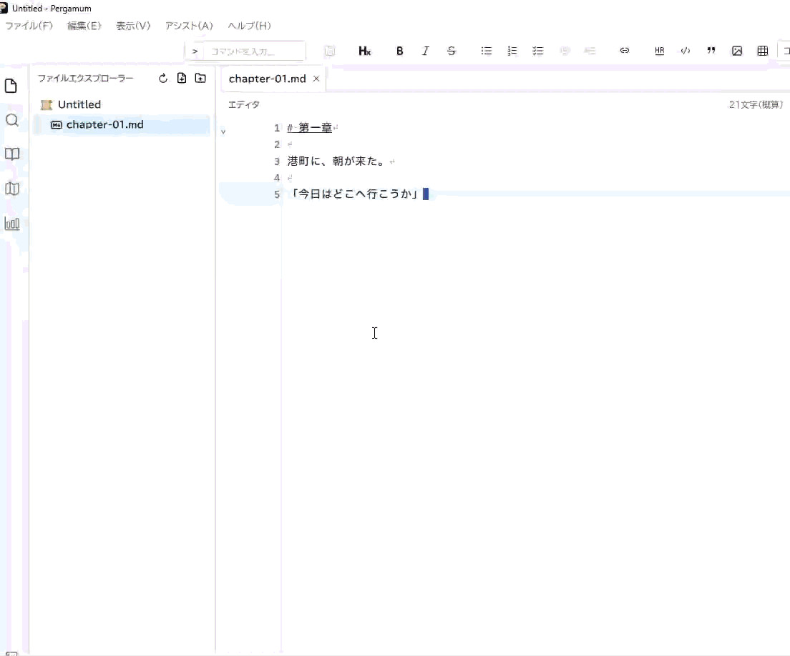

# マニュアルの保守・公開方針

これは執筆者向けのメモです。読者の入口は [index.md](index.md) です。

## 正本と構成

Markdown を正本とし、本文は次の3部で保守します。

- index.md：1. はじめに。思想、代表機能、目次。
- basics.md：2. 基本操作。最初の原稿を作成・保存するまで。
- features.md：3. Pergamumを使いこなす。代表的な機能を目的別に紹介。

全機能や全設定の網羅は目指しません。機能ページの分割は必要になってから行います。既存の docs/ の ADR・設計資料は変更・移動せず、公開に含めません。

## 画像・GIF の追加

静止画は assets/images/、操作 GIF は assets/gifs/ に置きます。ファイル名は英小文字の kebab-case にします。各ディレクトリの .gitkeep は、画像が届く前の配置場所を保持するための空ファイルです。

本文の引用形式の TODO に、予定パスと撮影内容を記載しています。現在は画像ファイルも未存在画像への表示用リンクも追加していません。ユーザーが素材を用意したら、TODO を代替テキスト付きの相対参照へ置き換えます。

    

GIF は一つの操作に絞り、数秒〜十数秒を目安にします。画像中の名前・本文は練習用データにそろえます。

## GitHub Pages の初期公開方針

この初稿では deployment 方針を定め、公開用 workflow はまだ追加しません。公開時は次の構成にします。

1. GitHub Actions で Markdown を HTML に変換する。入力は docs/manual/ のみとする。
2. 変換時に .md のページリンクを .html に置き換える。明示したセクション ID と相対 assets パスを保持する。
3. 本文3ページと assets/images/・assets/gifs/ の素材だけを、専用の出力ディレクトリへ生成・コピーする。保守用 README.md と .gitkeep は公開しない。
4. 生成物のリンク・画像を確認し、その出力ディレクトリだけを Pages artifact として渡す。
5. GitHub Pages は Actions を公開元に設定する。branch source を /docs 全体に向けない。

生成 HTML は正本として編集しません。リポジトリ全体や既存 docs/ をコピーする構成も使いません。高度な検索・多言語化・バージョン切替は初期構成に含めません。

公開前 TODO: 変換ツールと workflow を決め、Pages 上でページ間リンク・セクションリンク・画像を確認する。この段階では、サイト生成・Pages 公開は未検証です。

## 原稿の確認

- UI の日本語ラベルと既定ショートカットを現行実装と照合する。
- リンク先のファイルとセクション ID を確認する。
- 画像 TODO のパス・撮影内容を確認する。
- Pergamum で3ページを開き、基本操作を練習用プロジェクトで通して確認する。
- 素材追加後はプレビューと公開用 HTML の両方で表示を確認する。

初稿は Issue #730 の作成時点の main を基準にしています。GUI での操作確認と画像を使った確認は別途行います。
