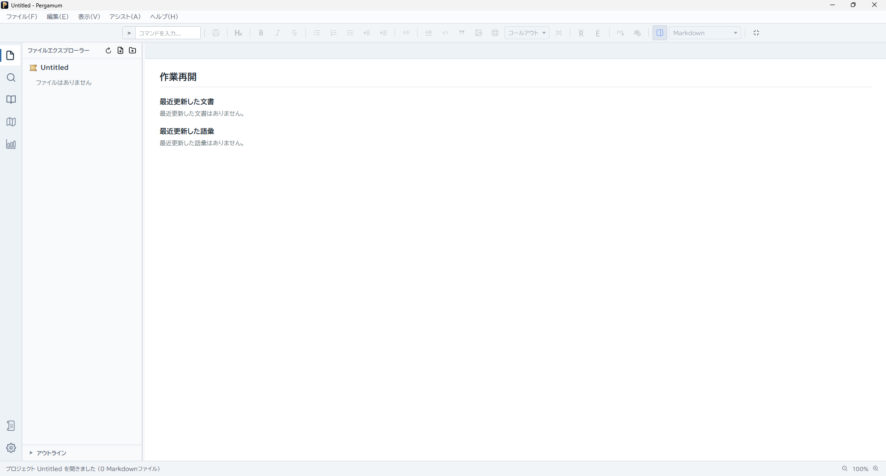
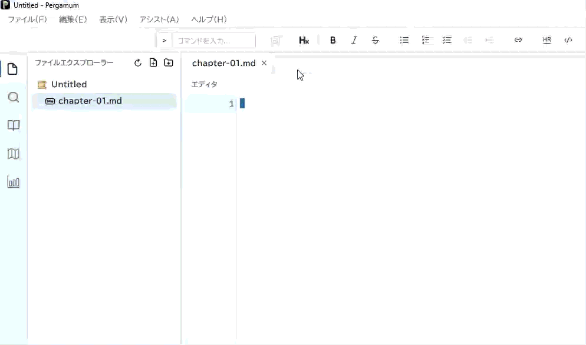
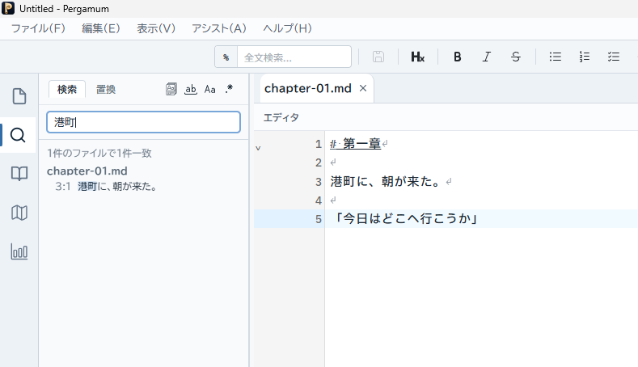

# 2. 基本操作

ここでは、練習用の作品を作り、短い原稿を書いて保存します。操作名やショートカットは既定の状態を基準にしています。

<a id="project"></a>
## プロジェクトを作る・開く

プロジェクトは、一つの作品の原稿や作品情報をまとめる作業場所です。.pergamum ファイルがプロジェクトを開く入口になり、そのファイルのあるフォルダがプロジェクトのルートになります。

1. 練習用に空のフォルダを用意します。例：練習作品。
2. **ファイル → プロジェクトを作成...** を選びます。
3. 保存先をそのフォルダにし、練習作品.pergamum という名前で保存します。
4. プロジェクトが開き、File Explorer にフォルダ内のファイルが表示されます。

既存の作品を開くときは、**ファイル → プロジェクトを開く** から、その作品の .pergamum ファイルを選びます。フォルダだけを選ぶ操作ではありません。



<a id="write-and-save"></a>
## Markdown ファイルを作って書く

1. File Explorer で原稿を置くフォルダを右クリックし、**新規ファイルを作成...** を選びます。
2. ファイル名を chapter-01、拡張子を .md にして、**ファイルを作成** を押します。
3. 作成したファイルを File Explorer から開きます。
4. エディタに、次の短い文章を入力します。

```Markdown
# 第一章

港町に、朝が来た。

「今日はどこへ行こうか」
```

「# 」は見出しを表します。段落の間には空行を入れます。すべての Markdown 記法を覚えてから書き始める必要はありません。必要なときにアプリ内の **Markdown チートシート** を参照できます。

**ファイル → 新規ファイル**（Windows / Linux：Ctrl+N、macOS：⌘N）から未保存の文書を作り、あとで名前を付けて保存することもできます。

### 保存する

**ファイル → 保存** を選びます。Windows / Linux では Ctrl+S、macOS では ⌘S です。未保存文書の場合は、プロジェクトのフォルダ内に chapter-01.md などの名前で保存します。

複数の文書を編集したときは **すべて保存** を使えます。別の名前で残すときは **名前を付けて保存...** を選びます。保存先とファイル名を確認してから確定してください。



<a id="tabs-and-files"></a>
## タブとファイルを使う

File Explorer から別の原稿を開くと、タブで切り替えて読んだり書いたりできます。タブを閉じても、保存済みのファイルは削除されません。未保存の変更について確認が出たときは、残す内容を保存してから閉じます。

章ごとにファイルを分けるなら、chapter-01.md、chapter-02.md のように名前をそろえると探しやすくなります。File Explorer の右クリックメニューでフォルダの作成や名前の変更もできます。削除や移動は、表示された対象を確認して実行してください。

<a id="command-palette"></a>
## コマンドパレットを使う

コマンドパレットは、操作を名前で探して実行する共通の入口です。メニューの場所を覚えていなくても使えます。

1. Windows / Linux では Ctrl+P、macOS では ⌘P を押します。F1 でも開けます。
2. コマンドモードの先頭の「>」を残して、プレビューと入力します。
3. 候補から **プレビュー表示の切り替え** を上下キーで選びます。
4. Enter で実行します。実行せず閉じるときは Esc を押します。

候補が使えない場合は、原稿やプロジェクトが開いているか確認してください。ショートカットを変更している場合は、手元の割り当てに従ってください。


### ファイルや見出しへ移動する

先頭の記号を変えると、探す対象を切り替えられます。

| 入力 | できること |
| --- | --- |
| > に続けて操作名 | コマンドを探す |
| 記号なしでファイル名 | プロジェクト内のファイルを探す |
| # に続けて見出し | 開いている Markdown 文書の見出しへ移動する |
| @ に続けて用語 | 登録済みの語彙を探す |
| % に続けて文字列 | プロジェクト内を全文検索する |
| : に続けて行番号 | 開いている文書の指定行へ移動する |

<a id="search-and-replace"></a>
## 検索と置換

### 今開いている文書を探す

本文にカーソルを置き、Windows / Linux では Ctrl+F、macOS では ⌘F を押します。検索欄に「港町」を入力し、次の一致箇所へ移動して位置を確認します。

置換欄を開くには、Windows / Linux では Ctrl+H、macOS では ⌘⌥F を押します。検索文字列と置換後の文字列を入力し、まず一か所を置換して結果を確認します。全置換は、検索条件と一致箇所を確認してから使ってください。

### 作品全体を探す

コマンドパレットに「%港町」と入力して実行すると、プロジェクト検索へ進めます。結果からファイルと該当箇所を開けます。文書内検索と作品全体の検索は対象が異なるので、まず今開いている文書で操作に慣れると分かりやすくなります。



## 最初の練習の確認

プロジェクトを開き、chapter-01.md を作成し、本文を書いて保存できたら基本操作は完了です。別の章を開いたり、パレットでプレビューを表示したりしてみてください。

[前へ：1. はじめに](index.md) · [次へ：3. Pergamumを使いこなす](features.md)
