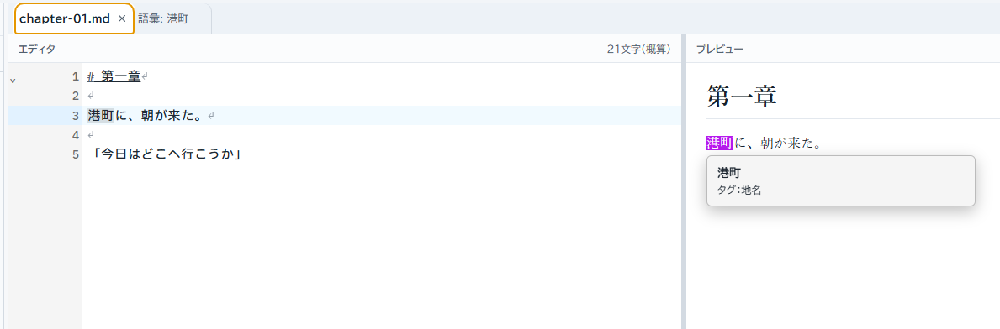
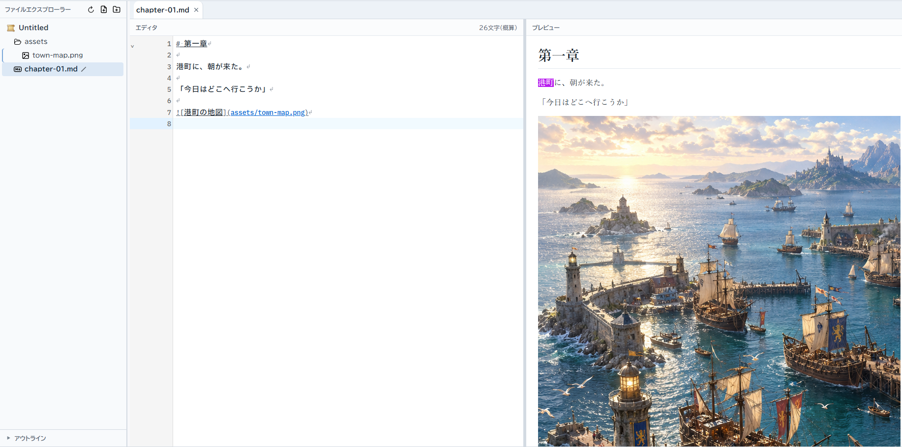
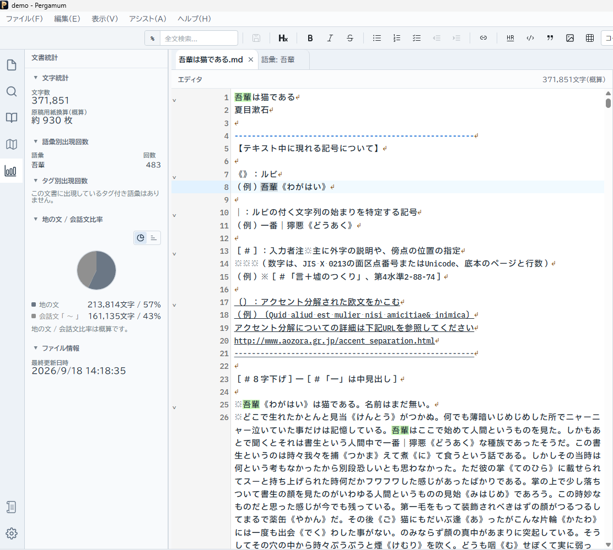
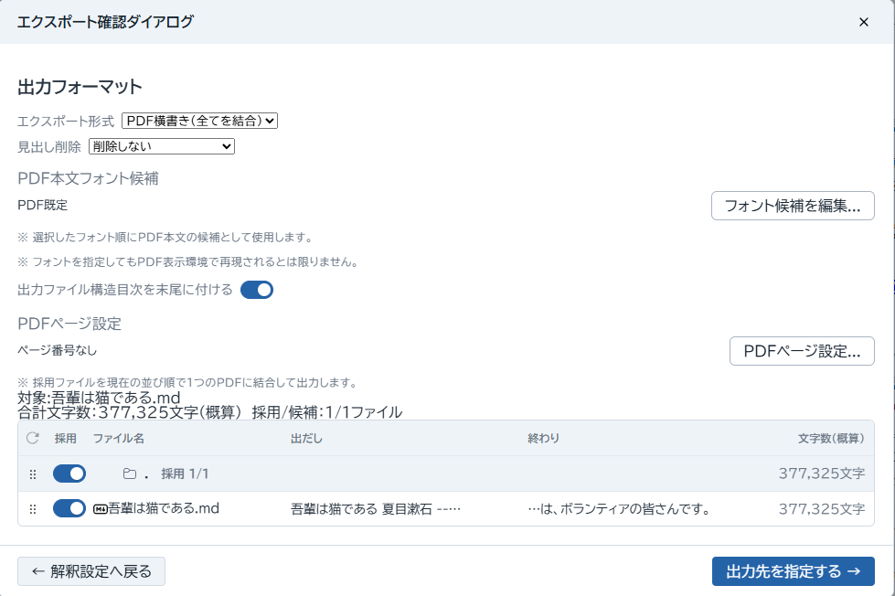
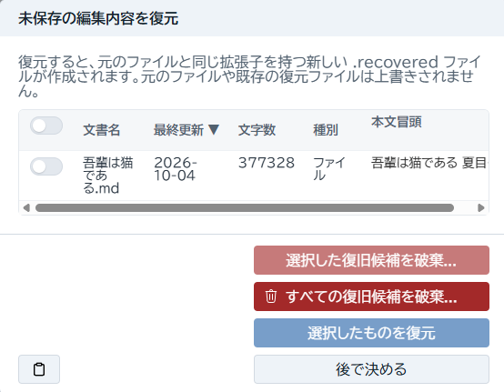

# 3. Pergamumを使いこなす

基本操作に慣れたら、執筆中に困っていることに合わせて道具を選んでください。ここでは代表的な使い方を紹介します。

## 語彙集：作品の人物や用語を整理する

人物名、地名、組織名などを語彙集（Glossary）に登録すると、説明や別称を本文とは別に管理できます。

1. コマンドパレットで **新しい語彙をタブで開く** を実行します。
2. 表記に「港町」を入力し、説明に町の設定を書きます。
3. 必要に応じてタグや別称を追加し、画面の保存操作で登録します。
4. **語彙集を表示** で登録した項目を探します。**語彙集: 語彙を管理** では一覧から編集できます。

別称は、同じ人物・用語を別の名前で呼ぶ場合などに使います。本文の表記を自動的に統一するためのものではありません。

登録済みの語彙は本文中の表示や Hover Card で確認できます。語彙の使用箇所を調べれば、その人物がどの章に登場するかを辿れます。本文中で Ctrl+Space を押すと語彙補完を呼び出せます。候補を確認して選んでください。

## プレビュー：見出しや画像の表示を確認する

Markdown 原稿を開き、コマンドパレットで **プレビュー表示の切り替え** を実行します。本文に書いた見出しや画像などが、どのように表示されるか確認できます。

プレビューは本文を読むための表示です。文章を直すときはエディタ側で編集します。画像を参照する場合は、原稿からの相対パスで記述すると、作品フォルダごと扱いやすくなります。

    

これは作品内の画像参照の例です。画像は自分の作品の assets/images/town-map.png に用意してください。画像が出ないときは、ファイルの場所と名前を確認します。

## 文書マップ：長い章の中を移動する

コマンドパレットで **文書マップを表示** を実行します。文書全体を俯瞰し、読みたい位置をクリックして移動できます。長い章の前半と後半を行き来したいときに便利です。

見出しの名前を覚えている場合は、パレットの「#」に続けて見出しを入力する方法も使えます。

## 文書統計：原稿の分量を確かめる

原稿を開いて、コマンドパレットで **文書統計を表示** を実行します。文字数、原稿用紙換算、語彙別の出現回数などを確認できます。特定の人物や用語が多く登場する章を見直す手がかりにもなります。

原稿用紙換算や地の文・会話文の比率は概算です。投稿先などに文字数の規定がある場合は、その数え方も確認してください。

## エクスポート：章をまとめて出力する

プロジェクトの原稿を、用途に合わせてまとめて出力できます。まず原稿を保存してから進めてください。

1. コマンドパレットで **エクスポート...** を実行します。
2. 確認画面で、出力するファイルの「採用」を確認します。設定メモなど、含めないファイルは外します。
3. ファイルの並び順を確認し、必要なら並べ替えます。
4. TXT（UTF-8）、HTML、PDF など、画面で選べる形式から用途に合うものを選びます。
5. 保存先と名前を確認して出力し、できたファイルを開いて内容と順序を確認します。

TXT はテキストとして渡したいとき、HTML はブラウザで読みたいとき、PDF はページの形を保って渡したいときに向いています。PDF では横書き・縦書きを選べます。本文の書式の解釈や画像の扱いは、選んだ形式の説明を確認してください。

出力結果は原稿から作る成果物です。修正の正本は、プロジェクト内の原稿として保管します。

## Plain Text：.txt ファイルで書く

Markdown の記法を使わずに書きたい場合は、平文テキスト（.txt）も扱えます。プロジェクト設定で平文テキストファイルのサポートを有効にしてから、File Explorer で .txt ファイルを開きます。

.txt では Markdown プレビューや見出しジャンプなどの Markdown 専用機能は使いません。文字コードを変更するときは、設定画面の説明を読み、既存の文章が正しく表示されることを確認してください。

## 作業の再開と復旧

前回開いていたタブなどを戻す仕組み（Session）と、未保存本文の復旧候補を扱う仕組み（Recovery）は役割が異なります。タブが戻ったことだけで、原稿を保存したことにはなりません。

復旧候補が表示されたら、対象のファイル名と本文を確認して復元します。復元された本文は、元ファイルを直接上書きせず、.recovered.md などの別ファイルとして開かれます。元の原稿と内容を比べ、残す内容を確認して保存してください。

候補を明示的に破棄すると、その復旧用の本文は削除されます。判断がつかないときは、候補を破棄せず確認画面を閉じ、あとで確認できます。

Recovery は保存やバックアップの代わりにはなりません。日常の保存に加え、作品フォルダ全体のバックアップも取ってください。

## 設定は目的から探す

読みやすい文字にしたいときはフォント、原稿の分量の数え方を変えたいときは文字数、平文で書きたいときは .txt のサポートなど、目的に合う項目を設定画面で探してください。

アプリ全体に使う設定と、作品ごとのプロジェクト設定があります。項目の説明と適用範囲を確認して変更します。ショートカットは **ファイル → キーボードショートカット...** から確認・変更できます。

## さいごに

物語を書くのは、あなたです。Pergamum は、その机の上を少し整える道具でありたいと思っています。このアプリケーションが、快適な執筆環境づくりのお手伝いをできれば、なによりです。

不具合のお知らせや、「こんな機能があったら」というご要望がありましたら、[GitHub Issues](https://github.com/Pergamum-IDE/Pergamum-IDE/issues) から作者へお寄せください。執筆の合間にいただく声も、この道具を育てる手がかりになります。

それでは、よい執筆を。次の一行が、あなたの物語につながりますように。

[前へ：2. 基本操作](basics.md) · [目次：1. はじめに](index.md)
