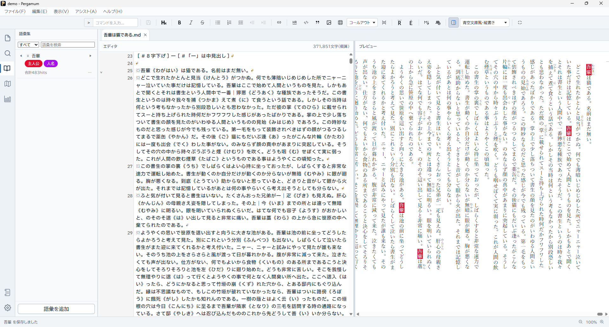
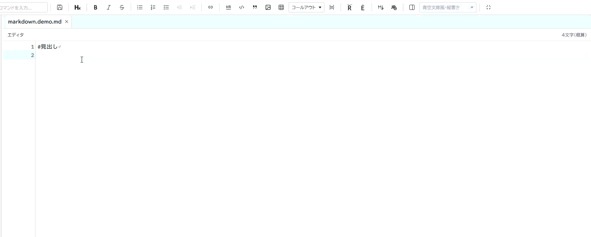
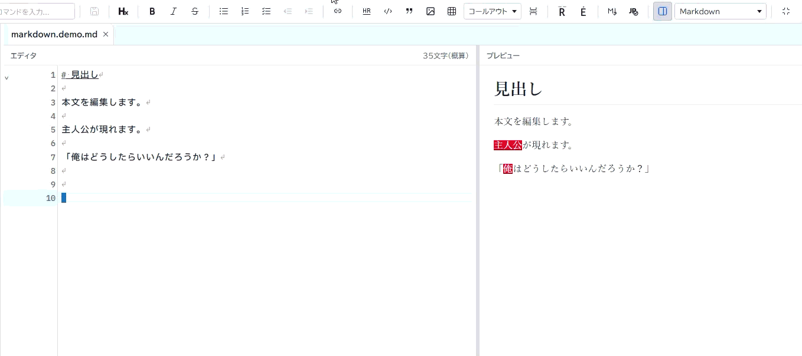
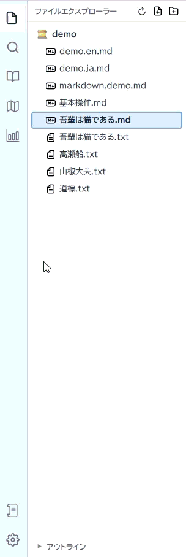

# 

[日本語](./) | English

**IDE for novelists**

## An integrated writing environment for your stories.

Pergamum is an open-source integrated writing environment built for novelists.

Write your manuscript.  
Organize characters, places, and terminology.  
Navigate long works.  
Preview your writing and export the finished result.

Pergamum brings the tools you need for writing long-form fiction together in a single project.

**[Download for Windows](https://github.com/Pergamum-IDE/Pergamum-IDE/releases/latest)**  
[User Manual](./en/) · [GitHub](https://github.com/Pergamum-IDE/Pergamum-IDE)

**Free and open source (MIT License)**  
v0.90.0 BETA / Windows version available

---

---

# A novel is more than just its manuscript.

The longer a story becomes, the more there is to remember.

Characters and their aliases.  
Places. Organizations. Worldbuilding.  
“When did this character last appear?”  
“Which chapter mentioned that detail?”

Pergamum separates **the place where you write your manuscript** from **the place where you keep what you know about your fictional world**, while bringing both together in one writing environment.

---

# Write

Write your manuscript directly in Markdown or Plain Text.

Open multiple chapters in tabs and work with search and replace, the Command Palette, the Markdown toolbar, and other editing tools.

Markdown Preview lets you check ruby annotations, emphasis marks, images, and more. The editor and preview can also keep their scroll positions synchronized.

---

# Remember

Characters, places, organizations, terminology.

Information you want to remember about your story can be managed separately from the manuscript in the **Glossary**.

Each entry can contain a name, aliases, tags, and a description.

While writing, you can complete registered terms, view their information in place, and navigate through the places where they appear in your manuscript.

---

# See the whole picture

In a long manuscript, knowing **where things are** can be just as important as writing them.

Pergamum includes a **Document Map** that gives you an overview of the current document.

**Document Metrics** provides information such as character counts, estimated manuscript pages, dialogue ratio, and occurrence counts for registered glossary terms.

You can also search across the entire project and quickly navigate to files, headings, and glossary entries.

---

# Deliver

When your manuscript is ready, you can select files from your project, arrange them in the order you want, and export them together.

Pergamum currently supports TXT (UTF-8), HTML, and PDF export.

PDF output supports both horizontal and vertical writing.

---

# Your manuscript is not locked inside Pergamum.

The source of truth for manuscripts written with Pergamum is an ordinary **Markdown (.md) or Plain Text (.txt) file**.

You can still read and edit your manuscript with a normal text editor even without Pergamum.

Structured information such as characters and terminology is stored in `.pergamum`, while project settings are stored in `pergamum.json`.

We believe your manuscript itself should never be trapped inside a proprietary format.

---

# The story is yours to write.

Pergamum is not an AI writing tool designed to write your novel for you.

Remember the characters and worldbuilding decisions you have already made.  
Jump quickly to the manuscript you need.  
Keep sight of a story as it grows longer.  
Save your work safely and export it in the form you need.

Pergamum aims to be **a tool that helps authors remember what they have already decided**.

---

# Pergamum v0.90.0 BETA

The core features of the novel-writing IDE are now in place, and v0.90.0 BETA is available as the first public release.

A Windows installer is currently available.  
(Because the application is not code-signed, Windows may display a warning when you run the installer.)

**[Download Pergamum](https://github.com/Pergamum-IDE/Pergamum-IDE/releases/latest)**

[Getting Started](./en/)  
[View the source code](https://github.com/Pergamum-IDE/Pergamum-IDE)  
[Send feedback or report an issue](https://tally.so/r/vGQ06X)  
[Report an issue on GitHub](https://github.com/Pergamum-IDE/Pergamum-IDE/issues)

> v0.90.0 is a BETA release. Until version 1.0, breaking changes to project data compatibility may occur. We recommend keeping a backup of your entire project folder for important works.

---

**Pergamum — IDE for novelists**

MIT License / Open Source